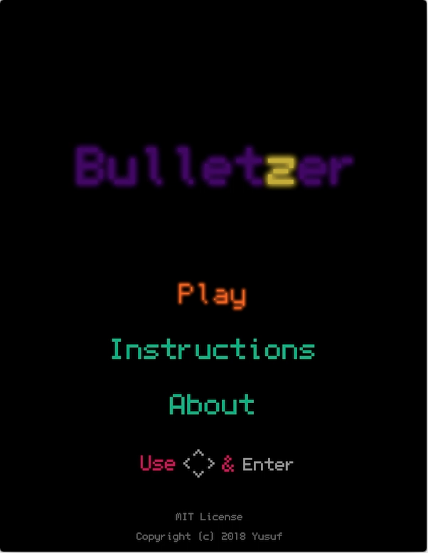
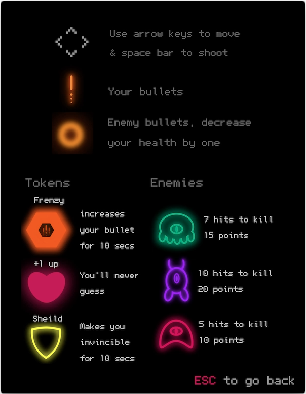
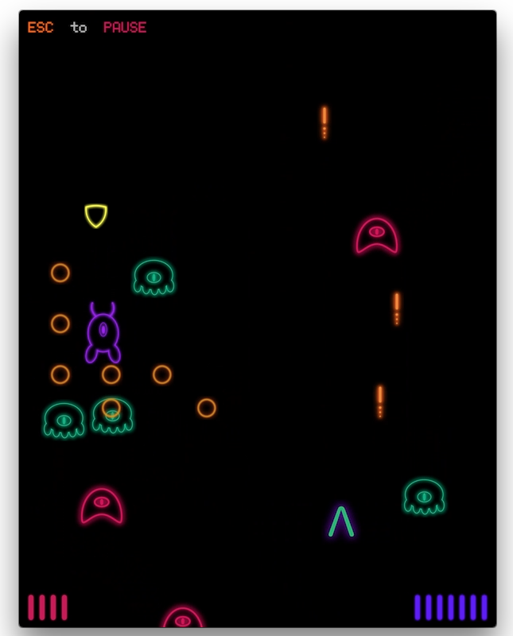
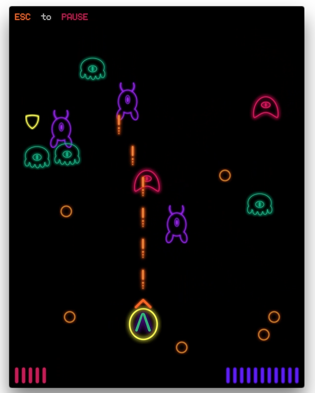
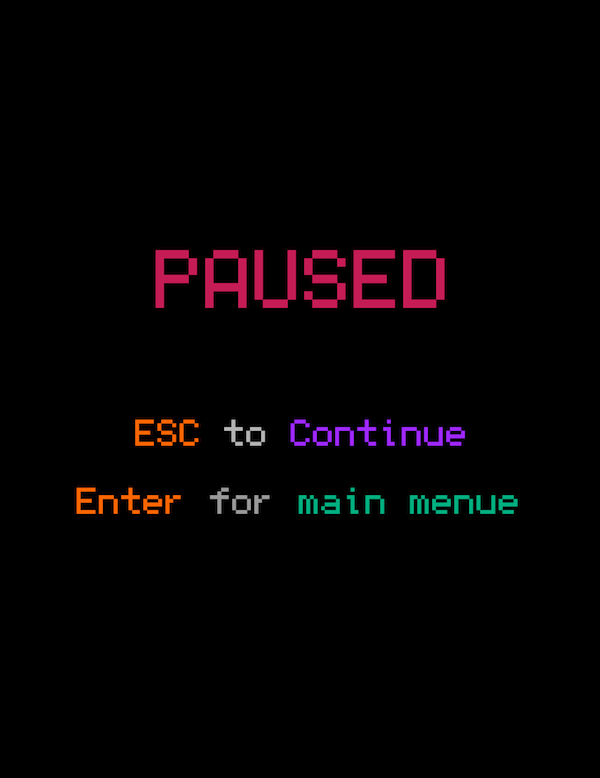

# Bulletzer

Bulletzer is my midterm ICS4U game that is meant to strengthen my game logic and java usage.
The game I choose to do is a bullet hell game with a twist of my own (neon arcade theme).
I had alot of fun doing this and realised that although the change from a language to another
might change the syntax, it doesn't change the logic; my ICS3U final project was a similar game
but in python, [check it out](https://github.com/YusufTaha/RayZ) sometime.







## Usage
To run the game compile the Game file and run the executable using:


```java
javac Game.java && Game
```